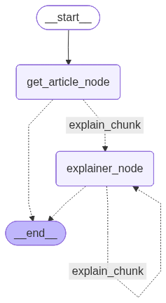

Article Explaier
--
Article explainer is splitted in two applications.
The backend, which uses fastapi to serve front end calls. And the frontend which is a react application.

Backend Application
--

The backend application uses fastapi to build an API with the goal to serve user calls. The API uses two main routes, the <b>graph router</b> and the <b>user router</b> found at [Backend_app/src/API/Routers/](https://github.com/c-azb/ArticleExplainer_cicd_AWS/tree/main/Backend_app/src/API/Routers).

The <b>user router</b> manage the user login, registration, access token and refresh token by interacting with a mongoDB database.

The <b>graph router</b> is responsible to make calls to the ai system, which is a <b>langgraph graph</b> found at [Backend_app/src/graph/](https://github.com/c-azb/ArticleExplainer_cicd_AWS/tree/main/Backend_app/src/graph). The graph was builded using an agent capable of produce a final full article explanation by combining small explanations of the article chunks.

The AI graph also is responsible to extract the article by a
user input. The 
article extraction was made using the <b>arxiv service</b>.

If the user is logged in after each explanation is generated, the explanation is stored in the database so he can visualize later.

<h3>Graph workflow Image </h3>

Frontend Application
--

The frontend application is a react.js application that interacts with the backend api by creating a friendly and interactive interface to the user.

Deployment
--

For the deployment was used a CI/CD workflow using github actions found at [.github/workflows](https://github.com/c-azb/ArticleExplainer_cicd_AWS/tree/main/.github/workflows). It uses two workflows, a <b>backend_workflow.yaml</b> to deploy the backend application to the <b>AWS lambda service</b> and the <b>frontend_workflow.yaml</b> to deploy the frontend application to a <b>AWS S3 service with AWS CloudFront</b> to host a static website.

